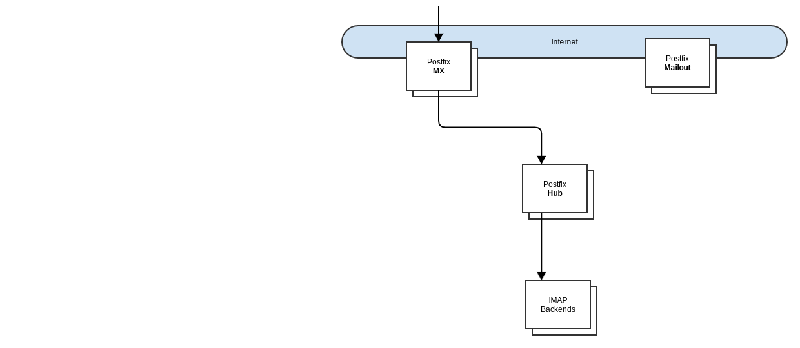
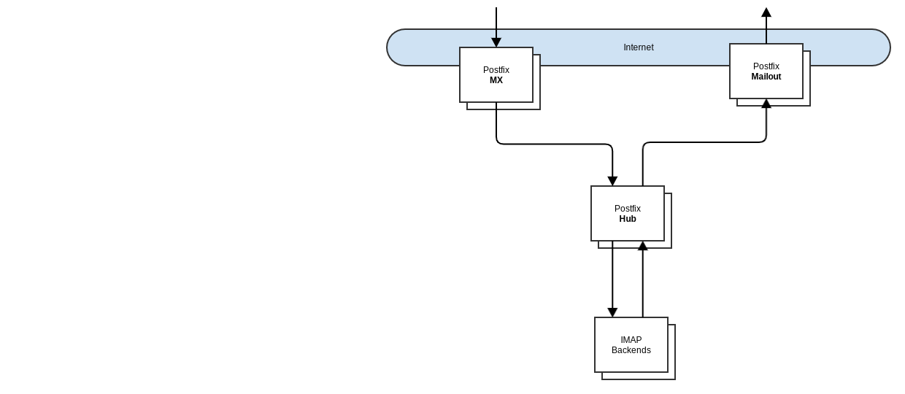
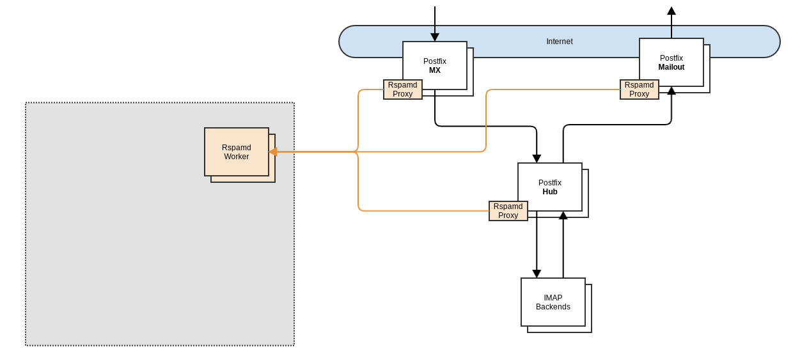
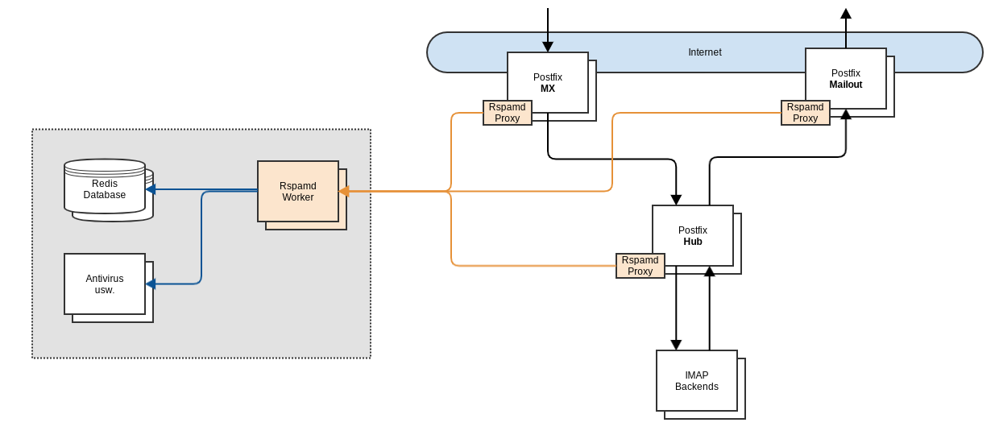
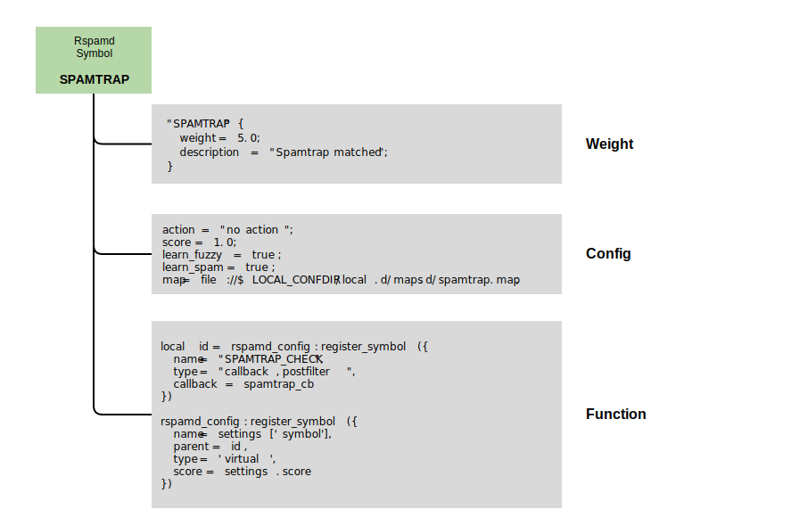

> [!IMPORTANT]  
> Die Fortsetzung des Workshops aus dem Jahr 2024 findet ihr hier: [https://github.com/HeinleinSupport/rspamd-slac-2024](https://github.com/HeinleinSupport/rspamd-slac-2024)
>
> Die Fortsetzung des Workshops aus dem Jahr 2025 findet ihr hier: [https://github.com/HeinleinSupport/rspamd-slac-2025](https://github.com/HeinleinSupport/rspamd-slac-2025)

# Sichere Mailcluster mit Rspamd, Spamhaus DQS und PeekabooAV

__Workshop auf der SLAC 2023__

[[_TOC_]]

*****
## Repo Status 25.5.2023

+ initiale Slides
+ derzeitige Rspamd Worker Config vom Ende des Workshops
+ TODO:
  + Postfix Config
  + Rspamd Proxy Config
  + Spamhaus DQS Slides und Config
  + PeekabooAV Einbindung Slides und Config
  + Kommentare

*****

## Redundanter Postfix Cluster

+ Wir trennen bei einer Postfix Infrastruktur gern die Systeme mit Internet-Kommunikation und internen Verbindungen
+ externe Systeme sollten im Idealfall keinen Zugriff interne Systeme haben (bzw. nur zum internen Postfix)
+ interne Mails laufen nicht über Systeme mit Verbindung zum Internet
+ MX Server (eingehend) und Mailout (ausgehend) stehen also in einer DMZ
+ HUB (interner Mailverteiler) steht im internen Netzwerk und kommuniziert auch mit MX und Mailout

*****

## Postfix Cluster #1

*****

## Postfix Cluster #2

*****

## Postfix Cluster #3

*****

## Postfix Cluster #4

*****

## Rspamd Anbindung

+ Um Single Points of Failure zu vermeiden installieren wir den Rspamd Proxy direkt auf dem Postfix System
+ Der Proxy bekommt eine Liste von Rspamd Backends, die lastverteilend angesprochen werden
+ Vorteil: Redundanz und Ausfallsicherheit
+ Jeder Postfix übergibt via `milter_macro_daemon_name` ein Keyword für seine Aufgabe im Cluster
  + z.B. _incoming_

*****

## Kapselung einzelner Dienste in eigene Systeme oder Container/CGroups

+ Redis reagiert empfindlich wenn der Arbeitsspeicher im System ausgeht
+ File Analyse-Tools wie Anti-Viren Systeme oder VBA/PDF-Analysen können bei der Analyse abstürzen
+ Darum sperren wir diese Tools gern in extra Systeme, Container oder mit anderen Mechanismen ein

*****

## Realworld Sizing

+ Wir benötigen nicht zwingend __xx__ VMs für einen wirkungsvollen Cluster
+ die Ideen hinter der Segmentierung/Aufteilung lassen sich auch lassen sich auch mit 2 Systemen umsetzen
+ es geht vor allem darum mögliche Sicherheitsprobleme zu minimieren und einen effektiven redundanten Cluster aufzubauen

*****

## Rspamd - Symbole, Module, Plugins, Funktionen

+ Rspamd denkt in Symbolen
+ Symbole im Rspamd sind wie Objekte, die auszuführende Funktionen haben, Konfigurationen, Beschreibungen, Punkte haben können
+ Symbole lassen sich zur Laufzeit an- und abschalten, logisch verknüpfen oder für forcierte Aktionen nutzen

*****

## Rspamd Composites

+ wirken wie die Meta Rules in Spamassassin und können noch einiges mehr
+ Matching erfolgt auf als logische Verknüfung auf aktivierte Symbole oder Gruppen
  + `expression = "INCOMING & BAD_SUBJECT";`
  + neues Symbol und Punkte hinzufügen
  + gematchte Symbole entfernen oder deren Score

*****

## Rspamd - Actions und Force Actions

+ Rspamd kennt verschiedene Aktionen, die bei einer bestimmten Summe von Punkten aktiviert werden können
  + no action
  + greylist (soft reject)
  + add header
  + rewrite subject
  + reject
+ dazu können je nach MTA auch eigene Aktionen definiert werden (Postfix/Milter z.B. discard, quarantine)
+ daneben lassen sich in den Force Actions mit logischen Verknüpfungen (expressions) von Symbolen auch Aktionen forcieren
  + `expression = "CLAMAV_VIRUS & !WHITELIST_ANTIVIRUS";`
+ direkte Aktionen lassen sich auch direkt in verschiedenen Plugins auslösen
  + Antivirus
  + Multimap
  + DMARC
  + Ratelimit
  + Spamtrap

*****

## Warum Aktionen direkt in den Plugins (oft) nicht sinnvoll sind

+ Ausnahmen von den Rejects (Whitelisting) können nicht mehr umgesetzt werden
+ Frühe Rejects lösen einen Passthrough aus, so dass andere Prüfungen abgebrochen werden
  + eindeutige Spam Mails werden ggf. nicht gelernt
+ Oft werden die Rejects in den Plugins eher pauschal ausgeführt
  + Antivirus z.B. verschlüsselte Mails oder Fehlercodes
  + Ratelimit alle Limits führen zu einem Soft Reject

*****

## Indikatoren sammeln und auswerten

+ Wir empfehlen Rspamd viele Indikatoren sammeln zu lassen und diese am Ende des Scan auszuwerten
+ Dafür werden Composites und Force Actions intensiv genutzt
+ Ausnahmen lassen sich auf einfache Weise umsetzen
+ Es kann eingehender, ausgehender und interner Traffic einfach unterschieden werden
+ Viren lassen sich z.B. in Spam (zum Lernen) und Malware (einfach ablehnen) kategorisieren
+ Ratelimit Rules können einzeln bewertet werden
  + Ablehnung bei bestimmten Rules
  + Info an den Admin bei anderen Limits

*****

## Rspamd Settings

+ Mit dem Settings Plugin im Rspamd lässt sich ein Scan-Profil erstellen, dass abweichende Schwellwerte hat, bestimmte Funktionen deaktiviert oder explizit aktiviert
+ Oder einfach ein weiteres Symbol als Indikator für Composites oder Force Actions bereits stellt

*****
